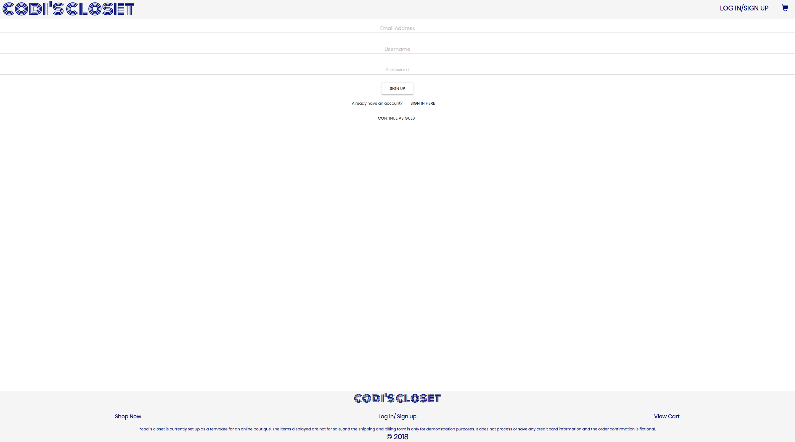
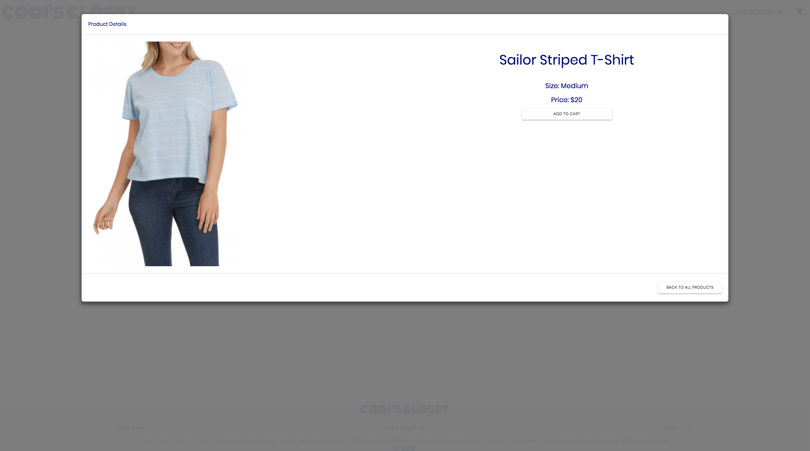
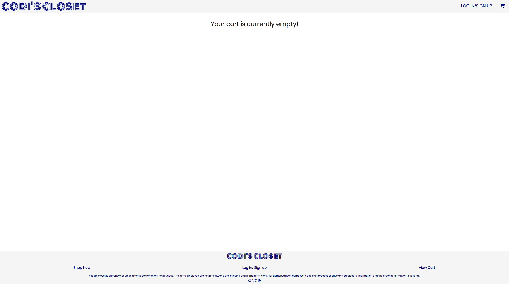
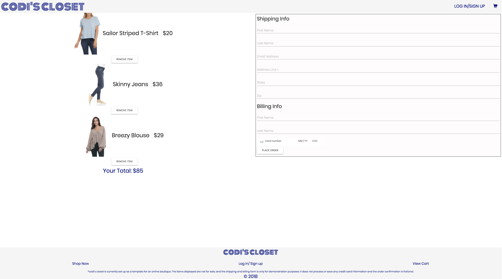

# CodisCloset
<https://github.com/codisteinborn/codiscloset> \
Version 1.0 \
Original Deployment Date - April 5, 2018

## The Idea
The idea behind this application is to mock an e-commerce site. It primarily serves as a template for a visual layout of an online clothing boutique.

## Starting the app locally
Start by cloning this repository down to your local device. While in this directory, run the following commands:
```
yarn install
cd client
yarn install
cd ..
``
After both installations complete, run the following command in your terminal:
``
yarn start
```
That's it, your app should be running on <http://localhost:3000>.

## Viewing Deployed App
<https://codiscloset.herokuapp.com/> \

Sign Up Page:

When a user arrives on this website, they will be prompted to sign up for an account. If they already have an account, they can switch over to the Sign In page. Additionally, they can choose to continue as a guest and shop without an account.


Product Page:

After a user logs in or chooses to continute as a guest, they are directed to the product page where they can view thumbnails of each available product. They can choose to click on an individual product's image or the accompanying 'VIEW DETAILS' button to view details about that product.


Product Detail Page:

The product detail page shows an enlarged photo of the product as well as the name, size, and price of the product. It also encludes an 'ADD TO CART' button as well as a 'BACK TO ALL PRODUCTS' button.


Cart Page:

If your cart is empty this page notifies you of that. Otherwise your cart will display the products you have added to your cart along with a total price of all items and a Billing and Shipping form with a 'PLACE ORDER' button. This form only validates information based on conditions I have set, and credit card information is neither processed nor stored.



## Built Utilizing:
React - <https://reactjs.org/> \
React Bootstrap - <https://react-bootstrap.github.io/> \
Bootstrap v3 - <http://getbootstrap.com/docs/3.3/> \
MUI - <https://www.muicss.com/> \
MongoDB - <https://www.mongodb.com/> \
Google Fonts - <https://fonts.google.com/> \
React Credit Card Input - <https://www.npmjs.com/package/react-credit-card-input> \

## Photo Sources:
Pixabay - <https://pixabay.com/> \

## Original Contributor
Codi Steinborn  - <https://github.com/codisteinborn/> \
